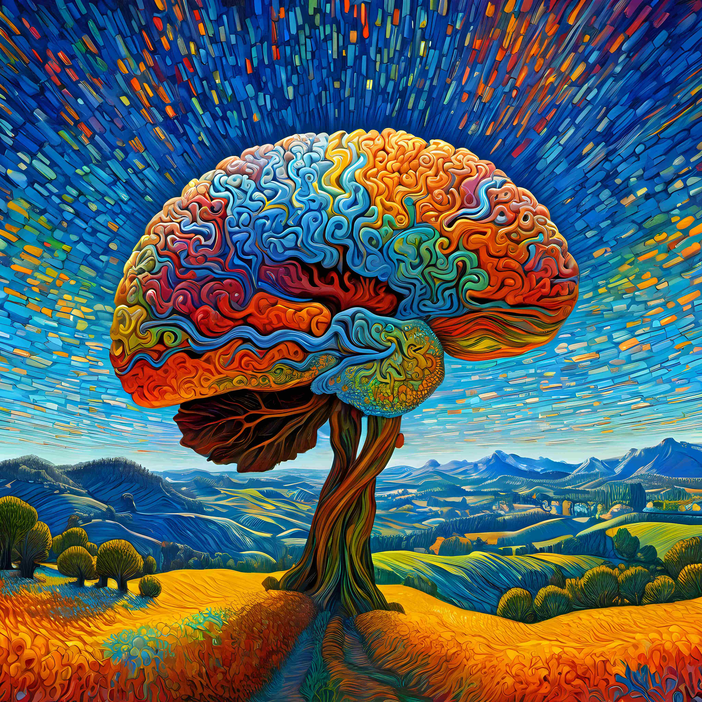

---
# try also 'default' to start simple
theme: default
# random image from a curated Unsplash collection by Anthony
# like them? see https://unsplash.com/collections/94734566/slidev
background: "./images/trees.jpg"
# some information about your slides, markdown enabled
title: Les psychédéliques, un traitment possible pour les tocs ?
info: |
  ## Slidev Starter Template
  Presentation slides for developers.

  Learn more at [Sli.dev](https://sli.dev)
# apply any unocss classes to the current slide
class: text-center
# https://sli.dev/custom/highlighters.html
highlighter: shiki
# https://sli.dev/guide/drawing
drawings:
  persist: false
# slide transition: https://sli.dev/guide/animations#slide-transitions
transition: slide-left
# enable MDC Syntax: https://sli.dev/guide/syntax#mdc-syntax
mdc: true
---

# Les psychédéliques, un traitment possible pour les tocs?

(Troubles obsessionel compulsifs)

---
layout: image-right
image: "./images/pencils.jpg"
---

# Qu'est ce que sont les TOCs ?

<v-click>
Le trouble obsessionnel compulsif (abrégé en l'acronyme TOC) est un trouble psychique caractérisé par l'apparition répétée de pensées intrusives — les obsessions — produisant de l'inconfort, de l'inquiétude, de la peur ; et/ou de comportements répétés et ritualisés

 - Wikipedia

</v-click>

---
mdc: true
---

# Quelques examples

- Lavage excessif des mains {v-click}
    - vouloir se laver les mains à chaques fois que l'on touche quelque chose
- Vérification répétée {v-click}
    - Vérifier plusieurs fois si la porte est bien verrouillée ou si le gaz est éteint.
- Comptage compulsif {v-click}
    - Besoin de compter des objets ou des actions selon un certains schéma.
- Accumulation {v-click}
    - Incapacité de jeter des objets sans valeurs
- Obsessions de symétrie et d'exhaustivité {v-click}
    - Besoin que tout soit parfaitement symétrique ou complet.
- Pensées intrusives {v-click}
    - Pensées choquantes ou inappropriées qui surgissent sans raison.
- Ritualisation des activités quotidiennes {v-click}
    - Besoin de suivre des routines strictes et complexes pour des tâches simples.
- Evitement {v-click
    - Éviter certaines personnes, lieux ou activités par peur de déclencher des obsessions ou compulsions.

---
layout: two-cols
---

# Pourquoi est-ce un problème ?

- Anxiété et stress accrus {v-click}
    - Les obsessions et compulsions peuvent générer beaucoup d'anxiété.
- Perte de temps {v-click}
    - Les rituels compulsifs peuvent prendre beaucoup de temps chaque jour.
- Isolement social {v-click}
    - La honte ou la peur de l'incompréhension peut mener à l'isolement.
- Problèmes relationnels {v-click}
    - Les TOCs peuvent peser sur les relations personnelles et familiales.

:: right ::

- Difficultés au travail ou à l'école {v-click}
    - La concentration et la performance peuvent être affectées.
- Dommages physiques {v-click}
    - Par exemple, le lavage excessif des mains peut causer des irritations cutanées.
- Problèmes financiers {v-click}
    - Certaines compulsions, comme l'achat compulsif, peuvent mener à des difficultés financières.
- Fatigue {v-click}
    - La gestion constante des obsessions et compulsions peut être épuisante.
- Dépression {v-click}
    - Les luttes constantes avec les TOCs peuvent contribuer à la dépression.
- Sentiment de perte de contrôle {v-click}
    - Le sentiment d'être contrôlé par les rituels plutôt que d'avoir le contrôle sur sa propre vie.

---
layout: two-cols
---
# Les traitements courrant
- Thérapie comportementale et cognitive (TCC) {v-click}
    - La TCC aide à identifier et à changer les pensées et comportements négatifs. La thérapie d'exposition et de prévention de la réponse est une forme de TCC spécifiquement efficace pour les TOCs.
- Médicaments {v-click}
    - Les inhibiteurs sélectifs de la recapture de la sérotonine (ISRS) sont couramment prescrits pour aider à gérer les symptômes des TOCs. Dans certains cas, d'autres types de médicaments peuvent également être utilisés.
- Thérapie de groupe {v-click}
    - Partager des expériences et des stratégies de gestion avec d'autres personnes qui ont des TOCs peut être utile.
- Thérapie familiale {v-click}
    - Parfois, inclure la famille dans le traitement peut aider à soutenir la personne atteinte de TOCs.
:: right :: 
- Applications de la santé mentale {v-click}
    - Des applications dédiées peuvent offrir un soutien supplémentaire, des rappels pour pratiquer des techniques de gestion de l'anxiété, et un suivi des progrès.
- Techniques de relaxation et de réduction du stress {v-click}
    - Le yoga, la méditation, et d'autres techniques de relaxation peuvent aider à gérer l'anxiété liée aux TOCs.
- Stimulation magnétique transcrânienne (SMT) {v-click}
    - Pour les cas résistants au traitement, la SMT peut être une option. Elle utilise des champs magnétiques pour stimuler certaines parties du cerveau.
- Psychochirurgie {v-click}
    - Dans des cas extrêmes et rares, lorsque les autres traitements n'ont pas fonctionné, une intervention chirurgicale peut être envisagée.

---
layout: image-left
image: "./images/prozac.jpg"
---

# Dans le cas médicamenteux:

Principalement les SSRI / ISRS

- Les ISRS (Inhibiteurs Sélectifs de la Recapture de la Sérotonine) ou SSRI (Selective Serotonin Reuptake Inhibitors) en anglais sont souvent le traitement le plus utilisé. {v-click}
- Leur mécanisme d'action, comme leur nom l'indique, vise le système sérotoninergique. {v-click}
- Le même traitement est également souvent utilisé contre la dépréssion. {v-click}
- Sauf que les doses sont 1.5 à 2x plus élevés pour traiter les toc que la dépréssion. {v-click}

---
layout: cover
background: "./images/psychelandscape.jpg"
---

# Les psychédéliques, un nouveau traitement ?

---
layout: two-cols
image: "./images/braintree.jpg"
---

# Un paralèle intéréssant ?
- Le méchanisme d'action principal des psychédélique classiques (Psilocybine, LSD, DMT, Méscaline) 
repose sur leur interaction avec le système sérotoninergique du cerveau.\
Plus précisément, ces substances agissent en se liant principalement aux récepteurs 5-HT2A de la sérotonine.

:: right ::

---

# Trois Rapport de Cas:

- Cas 1 (Daniel) : Soulagement complet des symptômes du TOC sévère après un traitement unique. {v-click}
- Cas 2 : Réduction durable des symptômes après consommation de champignons à psilocybine. {v-click}
- Cas 3 : réduction durable des symptômes sans effets secondaires {v-click} 
- Impact de la Psilocybine : Amélioration des symptômes du TOC. {v-click}
- Importance : Potentiel pour les cas résistants aux traitements traditionnels. {v-click}
- Potentiel pour d'autre pathologies {v-click}

- Heliyon 8 (2022) e12135

<!--
Dans le premier cas Daniel, un homme de 33 ans avec un TOC sévère, le syndrome de tourette et des épisodes dépréssifs majors ainsi que des crises de paniques, qui, malgré plusieurs traitements, n'avait jamais trouvé de soulagement significatif. Son score sur l'échelle Y-BOCS était de 24, indiquant un TOC sévère. Après un traitement unique à la psilocybine, Daniel a vécu une gamme d'émotions profondes et a décrit une sensation de renaissance. Remarquablement, 12 semaines après le traitement, son score Y-BOCS a chuté à 0, indiquant une absence de symptômes de TOC. Il percevait désormais ses symptômes de TOC comme 'vestigiaux', marquant une transformation profonde dans sa vie.

Dans le deuxième cas, présenté dans le Journal of Psychoactive Drugs, un patient souffrant de TOC a expérimenté une réduction cliniquement significative de ses symptômes suite à la consommation chronique de champignons contenant de la psilocybine. Cette amélioration s'est maintenue sur le long terme, suggérant un potentiel thérapeutique de la psilocybine et d'autres composés psychoactifs présents dans les champignons pour les cas de TOC résistants aux traitements habituels.

Dans le 3ème cas Le patient décrit est un homme de 38 ans confronté depuis l'enfance à une anxiété sévère et des pensées intrusives, qui ont évolué en un TOC invalidant. Malgré l'essai de multiples traitements conventionnels sans succès, il a trouvé un soulagement significatif dans l'auto-administration de psilocybine, un hallucinogène sérotoninergique, toutes les trois semaines. Cette approche non conventionnelle a conduit à une réduction durable des symptômes sans effets secondaires notables.

Ces trois cas soulignent le potentiel de la psilocybine comme traitement complémentaire pour les individus souffrant de TOC, en particulier pour ceux qui ne répondent pas aux approches thérapeutiques conventionnelles. Toutefois, ces observations préliminaires appellent à une recherche plus approfondie pour confirmer l'efficacité et la sécurité de la psilocybine dans le cadre d'un traitement clinique du TOC.
-->
---

# Une étude controllée:
Sécurité, tolérabilité et efficacité du psilocybine chez 9 patients atteints de trouble obsessionnel-compulsif.
(Safety, Tolerability, and Efficacy of Psilocybin in 9 Patients With Obsessive-Compulsive Disorder) Nov. 2006

<v-click>

## Contexte:

Des rapports anecdotiques suggèrent que les agents psychédéliques peuvent soulager les symptômes du trouble obsessionnel-compulsif (TOC). Cette étude en double aveugle modifiée a investigué la sécurité, la tolérabilité et les effets cliniques de la psilocybine, un agoniste puissant des récepteurs 5-HT1A et 5-HT2A/2C, chez des patients atteints de TOC.
</v-click>

<v-click>

## Méthode:

Neuf sujets atteints de TOC, définis par le DSM-IV, sans autre trouble psychiatrique majeur actuel, ont participé à jusqu'à 4 expositions uniques à des doses de psilocybine allant de sub-hallucinogènes à indiscutablement hallucinogènes. Les doses basse (100 µg/kg), moyenne (200 µg/kg), et haute (300 µg/kg) ont été assignées dans cet ordre, et une dose très basse (25 µg/kg) a été insérée aléatoirement et en double aveugle à tout moment après la première dose. L'étude s'est déroulée de novembre 2001 à novembre 2004.

</v-click>

<!--
[contexte]
Par example Un homme de 34 ans souffrait de TOC depuis l'adolescence. Il a commencé à utiliser des champignons psilocybes à 18 ans et a remarqué que pendant les intoxications, ses symptômes de TOC disparaissaient, une utilisation répétée a entraîné une tolérance aux effets psychédéliques, mais il a continué à ressentir un soulagement de ses symptômes malgré l'absence d'un "high".
-->

---

# Procédure:

- Durée des sessions : environ 8 heures {v-click}
- Environnement contrôlé {v-click}
- Lunettes opaques et musique standardisée pour favoriser l'introspection {v-click}
- Interactions sociales limitées {v-click}
- Surveillés par des accompagnateurs formés {v-click}
- Admission en unité psychiatrique pour nuit d'observation après chaque session {v-click}
- Évaluations régulières des effets de la psilocybine sur la santé mentale {v-click}
- Rencontres avec le personnel médical pour établir un lien de confiance et de soutien {v-click}
- Possibilité de discuter des préoccupations avant, pendant et après les sessions {v-click}

<!--

Chaque session durait environ 8 heures et se déroulait dans un environnement contrôlé. Les patients étaient confortablement installés et équipés de lunettes opaques pour restreindre les stimuli visuels. De la musique standardisée était diffusée pour accompagner l'expérience. Pendant la session, les interactions sociales étaient limitées pour favoriser l'introspection.

 Les patients étaient constamment surveillés par des accompagnateurs formés, qui étaient présents pour offrir un soutien émotionnel en cas de besoin. Après chaque session, les patients étaient admis dans une unité psychiatrique pour une nuit d'observation afin de garantir leur sécurité et de surveiller toute réaction post-administration.

Tout au long de l'étude, les patients ont été évalués régulièrement pour suivre les effets de la psilocybine sur leur état mental et leur bien-être général.

Pendant les sessions, les patients ont également eu l'occasion de rencontrer et de connaître le personnel médical et les accompagnateurs. Cela visait à établir un lien de confiance et de soutien, ce qui est crucial pour créer un environnement sûr et confortable pendant l'expérience psychédélique. Les patients ont pu discuter de leurs préoccupations, poser des questions et exprimer leurs sentiments avant, pendant et après les sessions.

Ce processus de familiarisation avec le personnel a contribué à renforcer la relation thérapeutique et à favoriser un sentiment de sécurité et de bienveillance tout au long de l'étude.

-->

---

# Résultats: 

Une réduction marquée des symptômes du TOC de degrés variables a été observée chez tous les sujets lors d'une ou plusieurs des sessions de test (23% à 100% de diminution du score YBOCS). Aucun effet significatif de la dose n'a été observé, mais une amélioration généralement durable au-delà du point de 24 heures a été notée.

# Conclusion:

Dans un environnement clinique contrôlé, le psilocybine a été utilisé en toute sécurité chez des sujets atteints de TOC et a été associé à des réductions aiguës des symptômes fondamentaux du TOC chez plusieurs sujets. Ces données justifient une exploration plus approfondie dans des études futures impliquant une méthodologie traditionnelle en double aveugle, randomisée, contrôlée par placebo.

<!--
[resultat]
Deux participants ont également constaté une amélioration symptomatique persistante pendant la semaine suivant les tests. Bien qu'il y ait eu une différence numérique dans les scores de base entre le premier test et les autres moments de test, il n'y avait pas d'effet d'ordre statistiquement significatif. Un sujet a même atteint une rémission à long terme après les quatre sessions de test, confirmée par un suivi six mois plus tard.

Il est possible que la dose ne soit pas si importante
-->
